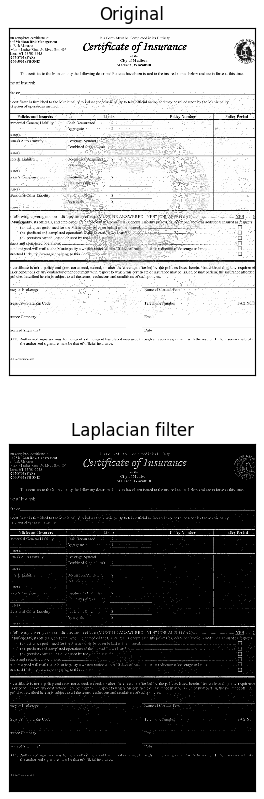
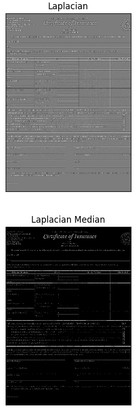
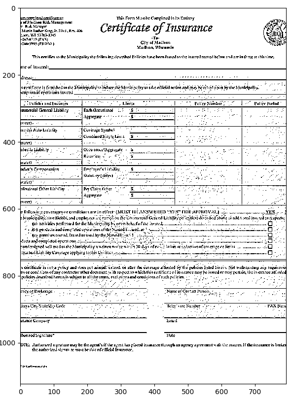

# Watermark_removal
A simple way for removing dot watermark background from the document

## Content
The input image contains the watermark background, we try to remove it  out using Laplacian and Median filter

## Requirements
* OpenCV
* Numpy
* Scikit-learn
* Matplotlib

## Running
Run main.py

## Result
The final result still has some salt noise, it can be improved by adjusting some parameter and threshold in the source code

